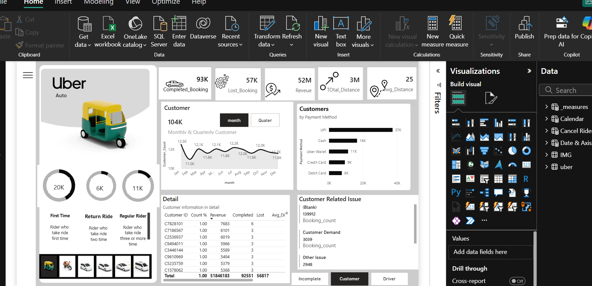
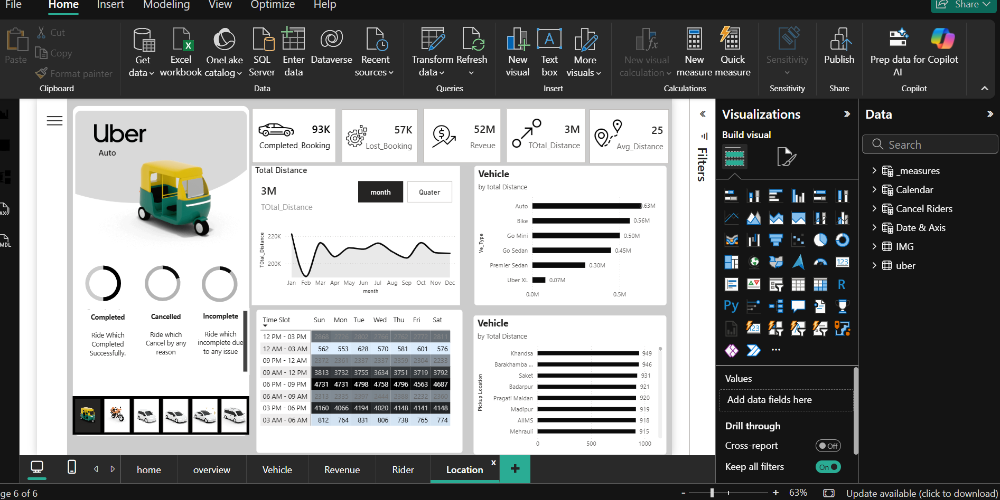

# Uber Trip Analysis Dashboard (Power BI)

## Project Overview

This Power BI project analyzes Uber trip data to understand ride demand, revenue trends, vehicle usage, rider behavior, and popular locations.

## Tools Used

* Power BI
* Excel
* DAX

## Dashboard Pages

### Home Page

### Overview Page

### Vehicle Analysis

### Revenue Analysis

### Rider Analysis

### Location Analysis

## Key Insights

* Peak trip demand hours
* Revenue trends across trips
* Vehicle usage patterns
* Rider activity insights
* Most popular pickup and drop locations

